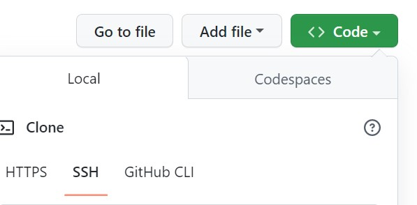
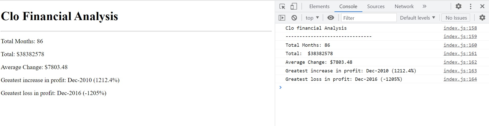

# CLO-Financial Analysis 
## Project Description

This is a financial analysis of month to month to help analysize CLO finicial records to check growth rate from January 2010 till Febuary 2017.

The main aim to help the business anaylsize the records and generate  reports for the stakeholders which is nedded to help them analysize the strategy used, and make an informed choice about the company strategy improvement task.

This report is generated using JavaScript programming language to analysize and generate the reports. **This is a console project but is also displayed in html  _webpage using javaScript_ **

 ## What is Included

 This Report shows:
 * Total number of months
 * The Total profit/losses for the time period.
 * The Average changes in Profit/Losses for the time period.
 * The greatest increase in profit month to month for the time period.
 * The greates decrease in losses month to month for the time period.
 

## How to run project on local machine
* Install Visual Studio Code
* Navigate to main page of the git Repository
* Click on the 'Code'
* Copy the SSH line to run on the Terminal or  the HTTPS link
* Clone the repository - 

## links
### Deployed Url: [CLO-Finance](https://yemioyedeji89.github.io/Console-Finances/).
## Web Page Screenshots

## Contribute
If you want to learn more about git clone. you can seek inspiration from the below:
### External files
[Github Docs](https://docs.github.com/en/repositories)

